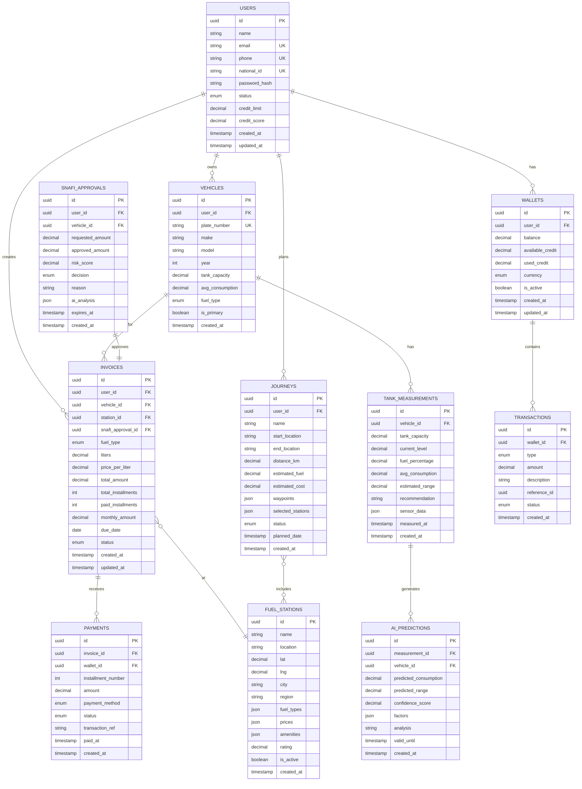
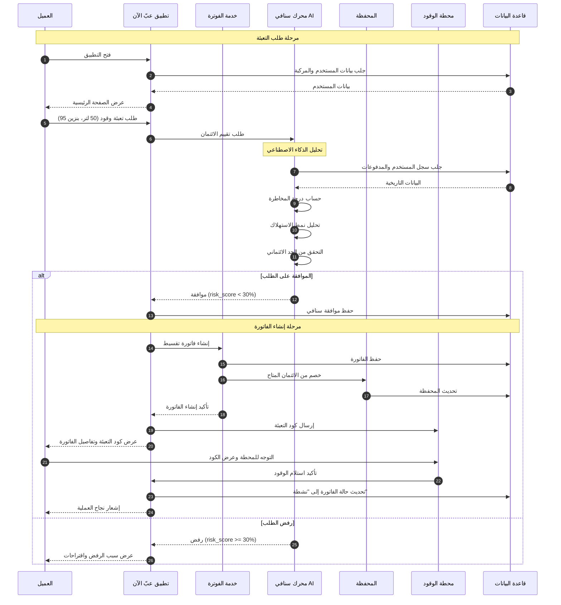
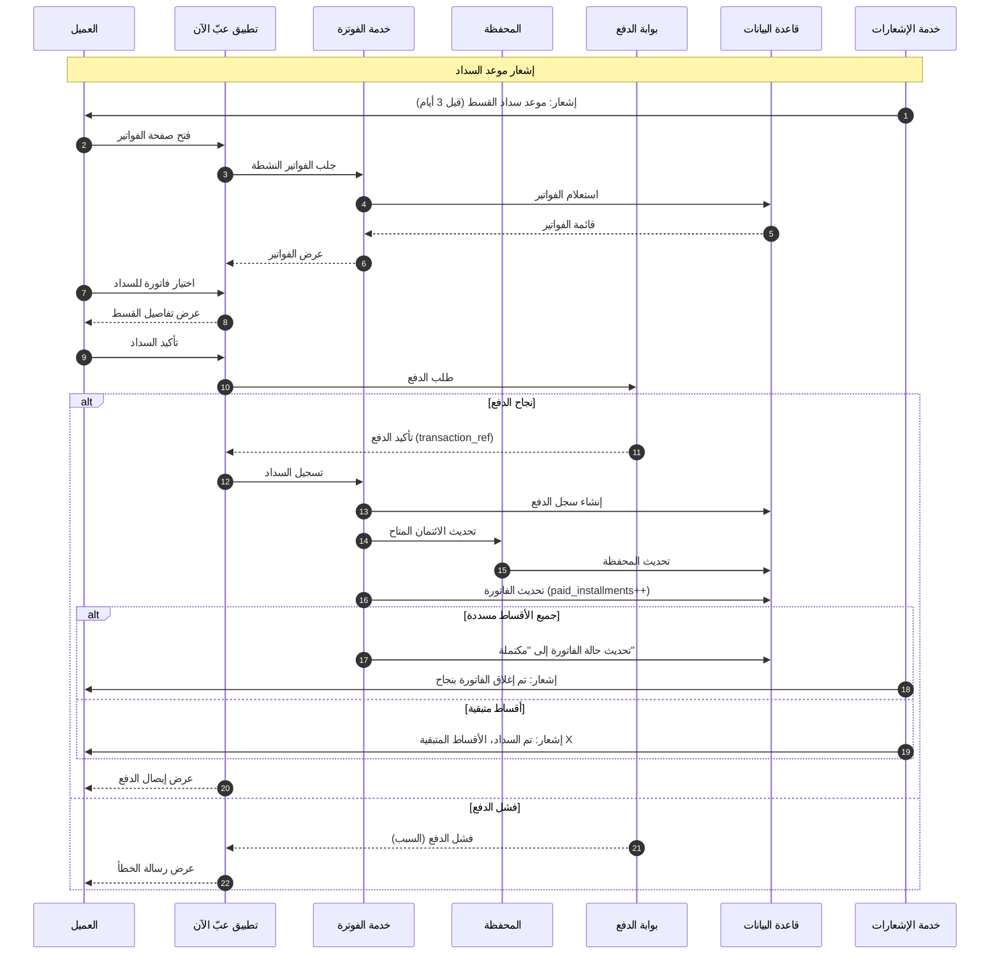
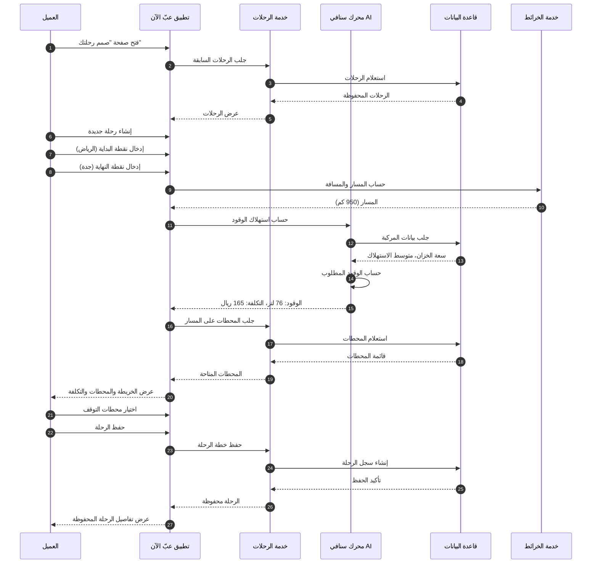
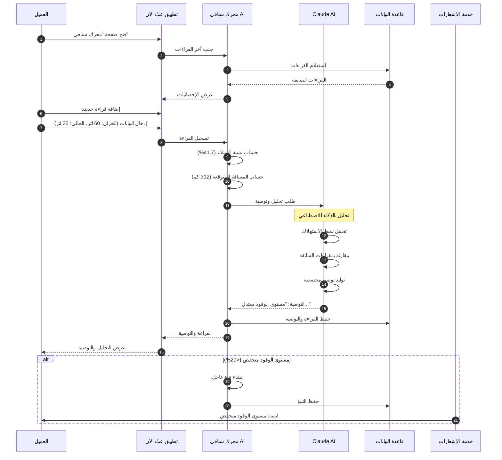
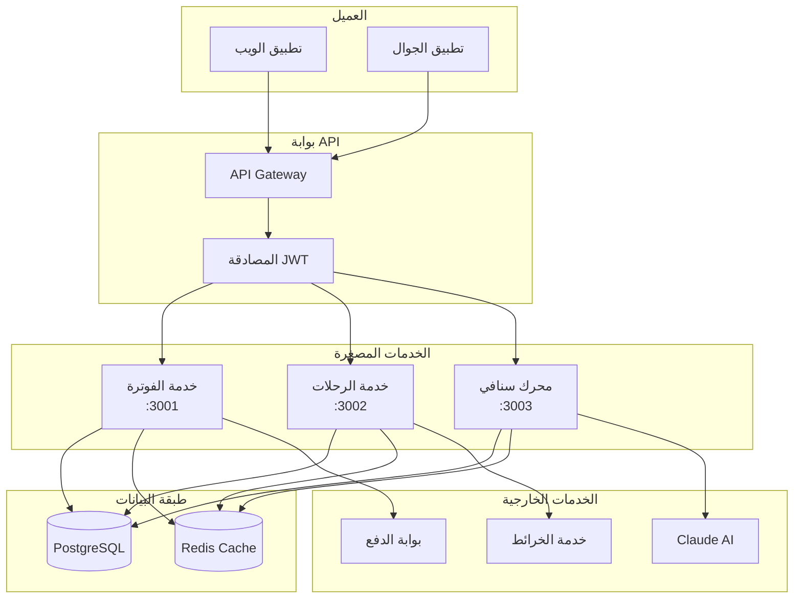
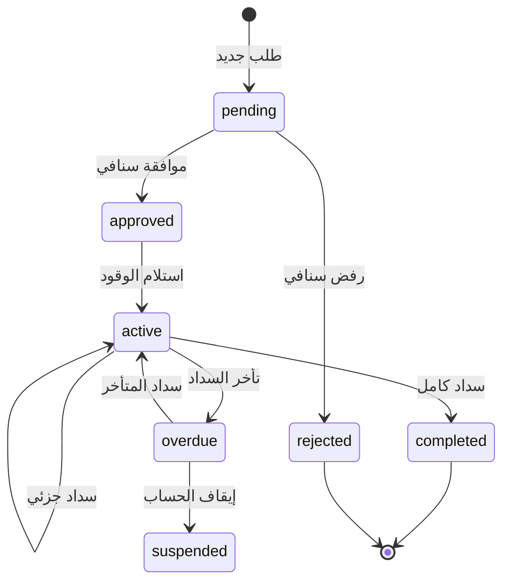
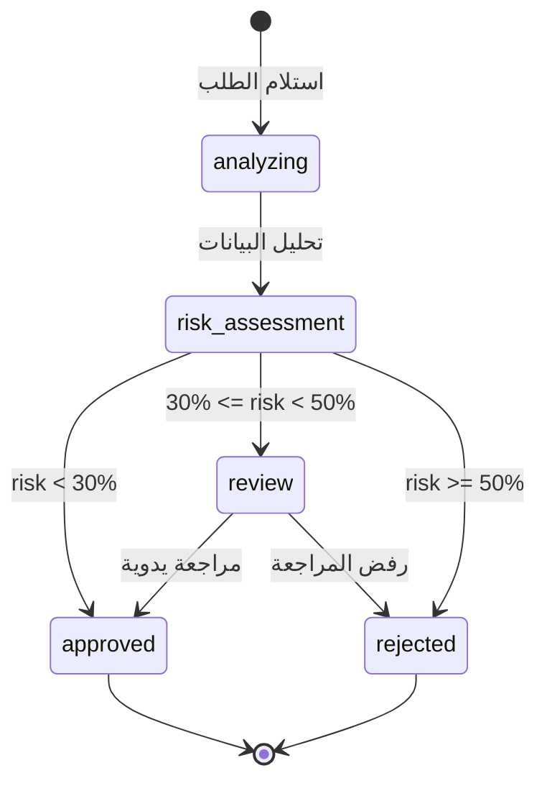

# تصميم نظام عبّ الآن - وثيقة البنية المعمارية

## نظرة عامة على النظام

نظام متكامل لتقسيط وقود السيارات يتكون من ثلاث خدمات مصغرة (Microservices):
1. **خدمة الفوترة (Billing Service)** - إدارة الفواتير والتقسيط
2. **خدمة الرحلات (Journey Service)** - تخطيط المسارات ومحطات الوقود
3. **محرك سنافي AI (Snafi AI Service)** - تحليل استهلاك الوقود بالذكاء الاصطناعي

---

## تصميم قاعدة البيانات (Database Schema Design)

### مخطط العلاقات (Entity Relationship Diagram)

---

### تفاصيل الجداول

#### 1. جدول المستخدمين (USERS)

| العمود | النوع | الوصف |
|--------|------|-------|
| id | UUID | المعرف الفريد |
| name | VARCHAR(100) | الاسم الكامل |
| email | VARCHAR(255) | البريد الإلكتروني (فريد) |
| phone | VARCHAR(20) | رقم الجوال (فريد) |
| national_id | VARCHAR(20) | رقم الهوية الوطنية |
| password_hash | VARCHAR(255) | كلمة المرور المشفرة |
| status | ENUM | (active, suspended, pending) |
| credit_limit | DECIMAL(10,2) | الحد الائتماني |
| credit_score | DECIMAL(5,2) | درجة الائتمان (0-100) |
| created_at | TIMESTAMP | تاريخ الإنشاء |
| updated_at | TIMESTAMP | تاريخ التحديث |

#### 2. جدول المحفظة (WALLETS)

| العمود | النوع | الوصف |
|--------|------|-------|
| id | UUID | المعرف الفريد |
| user_id | UUID | معرف المستخدم |
| balance | DECIMAL(12,2) | الرصيد الحالي |
| available_credit | DECIMAL(12,2) | الائتمان المتاح |
| used_credit | DECIMAL(12,2) | الائتمان المستخدم |
| currency | ENUM | (SAR, USD) |
| is_active | BOOLEAN | حالة المحفظة |

#### 3. جدول الفواتير (INVOICES)

| العمود | النوع | الوصف |
|--------|------|-------|
| id | UUID | المعرف الفريد |
| user_id | UUID | معرف المستخدم |
| vehicle_id | UUID | معرف المركبة |
| station_id | UUID | معرف المحطة |
| snafi_approval_id | UUID | معرف موافقة سنافي |
| fuel_type | ENUM | (91, 95, diesel) |
| liters | DECIMAL(8,2) | كمية اللترات |
| price_per_liter | DECIMAL(6,2) | سعر اللتر |
| total_amount | DECIMAL(10,2) | المبلغ الإجمالي |
| total_installments | INTEGER | عدد الأقساط |
| paid_installments | INTEGER | الأقساط المسددة |
| monthly_amount | DECIMAL(10,2) | القسط الشهري |
| status | ENUM | (pending, active, completed, overdue) |

#### 4. جدول موافقات سنافي (SNAFI_APPROVALS)

| العمود | النوع | الوصف |
|--------|------|-------|
| id | UUID | المعرف الفريد |
| user_id | UUID | معرف المستخدم |
| vehicle_id | UUID | معرف المركبة |
| requested_amount | DECIMAL(10,2) | المبلغ المطلوب |
| approved_amount | DECIMAL(10,2) | المبلغ الموافق عليه |
| risk_score | DECIMAL(5,2) | درجة المخاطرة |
| decision | ENUM | (approved, rejected, pending) |
| reason | TEXT | سبب القرار |
| ai_analysis | JSON | تحليل الذكاء الاصطناعي |

---

## مخططات تسلسل العمليات (Sequence Diagrams)

### 1. رحلة طلب تعبئة الوقود وإصدار فاتورة التقسيط

### 2. رحلة سداد القسط الشهري

### 3. رحلة تخطيط مسار وحساب الوقود

### 4. رحلة قياس مستوى الخزان وتحليل سنافي

---

## بنية الخدمات المصغرة (Microservices Architecture)

---

## نموذج البيانات المشتركة (Shared Data Models)

### حالات الفاتورة (Invoice Status Flow)

### حالات موافقة سنافي (Snafi Approval Flow)

---

## ملاحظات التنفيذ

### الأمان
- جميع كلمات المرور مشفرة باستخدام bcrypt
- المصادقة عبر JWT tokens
- تشفير البيانات الحساسة في قاعدة البيانات
- Rate limiting على جميع نقاط API

### الأداء
- استخدام Redis للتخزين المؤقت
- فهرسة الجداول على الحقول المستخدمة بكثرة
- Pagination لجميع القوائم
- Lazy loading للبيانات الثقيلة

### التوسع
- كل خدمة مصغرة مستقلة ويمكن توسيعها أفقياً
- قاعدة بيانات مشتركة مع إمكانية الفصل لاحقاً
- Message Queue للعمليات الطويلة (مستقبلاً)

---

*تم إنشاء هذا التصميم بواسطة Claude AI - نظام عبّ الآن*
*التاريخ: فبراير 2026*
